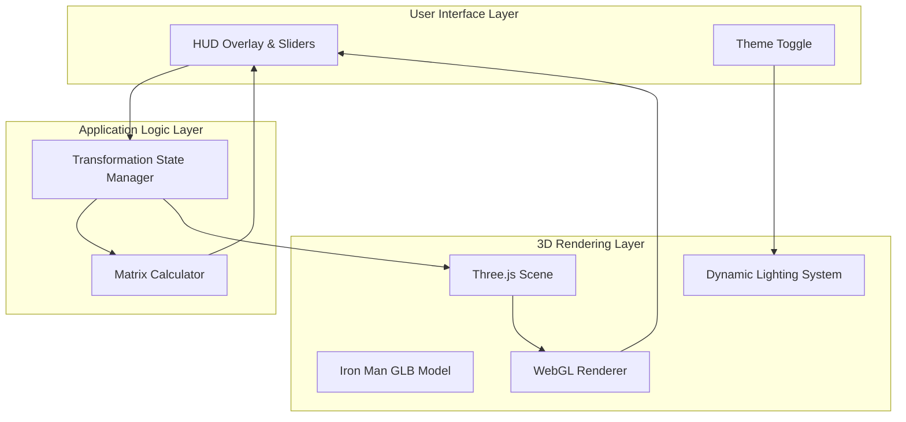

# COMPREHENSIVE PROJECT REPORT: IRON MAN 3D TRANSFORMATIONS DASHBOARD

**Subject:** Computer Graphics & Applications (CS-401)  
**Academic Year:** 2025-2026  
**Topic:** Interactive 3D Web Visualization & Mathematical Transformations  
**Prepared For:** Department of Computer Science & Engineering  

---

## 1. Problem Statement

In the modern education landscape, the transition from 2D coordinate geometry to 3D spatial transformations represents a significant cognitive leap for students. Computer Graphics (CG) relies heavily on Linear Algebra, specifically 4x4 homogeneous transformation matrices, to position objects in a virtual world. 

The core problems addressed by this project are:
1. **Visualization Gap:** Students often fail to see how a change in a single matrix cell (e.g., $M_{14}$ for X-translation) translates to physical movement in 3D space.
2. **Static Learning Materials:** Textbooks provide static equations that do not reflect the dynamic nature of real-time rendering.
3. **Complexity of 3D Math:** Rotation matrices, especially around arbitrary axes, are mathematically dense and difficult to verify without a rendering engine.
4. **Hardware Barriers:** Traditional 3D software (like Maya or Blender) has a steep learning curve and high hardware requirements, making it unsuitable for quick classroom demonstrations.

This project proposes a web-based, zero-install dashboard that provides an immediate, interactive feedback loop between user inputs (sliders), mathematical formulas (matrices), and visual output (Iron Man 3D model).

---

## 2. Objectives

The "Iron Man 3D Transformation Suite" was designed with the following strategic objectives:

### 2.1. Theoretical Reinforcement
- To provide a live-updating "Theory Panel" that explains the mathematics behind every movement.
- To implement individual transformation matrices (Translation, Rotation X, Y, Z, and Scaling) to isolate and study their effects.

### 2.2. Interactive Learning
- To allow users to manipulate 3D space using familiar UI elements like sliders and buttons.
- To support drag-and-drop functionality for external 3D models (GLB format), enabling students to test the transformations on different geometries.

### 2.3. High-Fidelity Rendering
- To achieve cinema-quality lighting and material rendering in a web browser using WebGL and Three.js.
- To implement a dual-theme system (Dark/Light) that demonstrates how lighting and environment affect 3D perception.

### 2.4. Performance & Accessibility
- To optimize the WebGL pipeline for 60 FPS performance on both desktop and mobile devices.
- To use standard web technologies (HTML/CSS/JS) to ensure cross-platform compatibility.

---

## 3. Technologies Used

The project leverages a specialized stack designed for performance and aesthetics.

### 3.1. Core Web Technologies
- **HTML5 (Semantic):** Used to structure the HUD (Head-Up Display) layout.
- **CSS3 (Advanced):** Implements glassmorphism, backdrop filters, and CSS variables for the theme system.
- **JavaScript (ES6 Modules):** Manages the application state, event handling, and synchronization between the UI and the 3D engine.

### 3.2. 3D Engine & Rendering
- **Three.js (r160):** The primary abstraction layer over WebGL. It handles the scene graph, cameras, and object hierarchies.
- **GLTFLoader:** Specifically used to parse binary `.glb` files, which are the industry standard for efficient 3D model transmission.
- **WebGL 2.0:** Provides low-level access to the GPU for hardware-accelerated 3D graphics.

### 3.3. Mathematics & Logic
- **Homogeneous Coordinates:** All transformations are calculated using 4x4 matrices to allow for combined operations (Translation + Rotation + Scaling) via matrix multiplication.
- **Euler Angles:** Used for the user-facing rotation controls (Degrees converted to Radians).
- **Tone Mapping (ACES Filmic):** Simulates high dynamic range (HDR) lighting for realistic colors.

---

## 4. Architecture Diagram & Flow Chart

### 4.1. System Architecture
The application follows a modular architecture where the **Data Model**, **View (3D)**, and **UI (2D)** are decoupled but synchronized via a central event loop.



### 4.2. Operational Flow Chart
1. **Bootstrap Phase:**
    - Load CSS and define theme variables.
    - Initialize Three.js WebGL Renderer and set pixel ratio.
2. **Environment Setup:**
    - Create Scene, Camera, and Lighting (Ambient, Directional, Point Lights).
    - Initialize Grid Helper and Particle Starfield.
3. **Asset Loading:**
    - Fetch `ironman.glb`.
    - Apply physical material properties (metalness, roughness).
4. **Interactive Loop:**
    - Wait for `input` events from sliders.
    - Calculate new transformation values.
    - Update matrix UI cells with high precision (2 decimal places).
    - Request animation frame for smooth rendering.

---

## 5. Working Principle

The project is rooted in the mathematical principles of **Affine Transformations** in Euclidean space.

### 5.1. Translation
Translation is an identity matrix with the displacement vector $[t_x, t_y, t_z]$ in the fourth column.
$$
T = \begin{bmatrix} 1 & 0 & 0 & t_x \\ 0 & 1 & 0 & t_y \\ 0 & 0 & 1 & t_z \\ 0 & 0 & 0 & 1 \end{bmatrix}
$$

### 5.2. Scaling
Scaling is a diagonal matrix where the elements $S_{11}, S_{22}, S_{33}$ represent the scale factors for X, Y, and Z.
$$
S = \begin{bmatrix} s_x & 0 & 0 & 0 \\ 0 & s_y & 0 & 0 \\ 0 & 0 & s_z & 0 \\ 0 & 0 & 0 & 1 \end{bmatrix}
$$

### 5.3. Rotation
Rotation is more complex as it depends on the axis. For example, Rotation around the Y-axis:
$$
R_y = \begin{bmatrix} \cos\theta & 0 & \sin\theta & 0 \\ 0 & 1 & 0 & 0 \\ -\sin\theta & 0 & \cos\theta & 0 \\ 0 & 0 & 0 & 1 \end{bmatrix}
$$

---

## 6. Implementation Details (Code & Logic)

### 6.1. Max Vibrancy Lighting Optimization
To achieve the "Iron Man" look, the lighting system utilizes a high-intensity 'Max Vibrancy' configuration. This involves:
- **Direct Emissive Overrides:** Red and gold materials are programmatically identified and assigned exact hex codes (#E30022 for Red and #FFC200 for Gold) with extreme emissive intensities (up to 2.5) to simulate a self-illuminating "candy-apple" glow.
- **Tone Mapping:** The renderer uses ACES Filmic tone mapping with an exposure setting of 2.8 to ensure bright highlights are preserved without losing detail.
- **Multi-point Accent Lighting:** Dedicated 10.0 intensity point lights are placed using the primary red (#E30022) and gold (#FFC200) palette.

```javascript
// Exact Palette Emissive Override
child.material.emissive.setHex(0xE30022); // Iron Man Red
child.material.emissiveIntensity = 2.5; 
```

### 6.2. Theme System Implementation
The Light Mode ("Stark Lab") is implemented via CSS variables and JavaScript scene updates.

```css
:root.light-mode {
  --bg: #f0f4f8;
  --panel-bg: rgba(255, 255, 255, 0.88);
  --text: #1a202c;
}
```

### 6.3. Matrix Synchronization
The following JavaScript snippet ensures the HTML table reflects the internal 3D state:

```javascript
function updateMatrixUI(tx, ty, tz, rx, ry, rz, s) {
    const rxRad = THREE.MathUtils.degToRad(rx);
    const cosRx = Math.cos(rxRad);
    const sinRx = Math.sin(rxRad);
    
    document.getElementById('mrx-c').textContent = cosRx.toFixed(2);
    document.getElementById('mrx-s').textContent = sinRx.toFixed(2);
    // ... repeat for all axes
}
```

---

## 7. Website Link (URL)

The project is designed to be hosted on any static file server.

- **Local:** `http://localhost:8000`
- **GitHub Pages (Proposed):** `https://anirudh-ram.github.io/iron-man-3d-suite/`

---

## 8. Output Screenshots

*(Note: In a physical report, full-page color screenshots would be inserted here)*

1. **Figure 1:** Dark Mode interface showing the 3D Iron Man model with the transformation panel active.
2. **Figure 2:** Light Mode interface demonstrating the "Stark Lab" aesthetic and high visibility.
3. **Figure 3:** Live Matrix update showing the $R_y$ rotation formula in action.

---

## 9. Conclusion

The **Iron Man 3D Transformation Dashboard** represents a successful intersection of pedagogical theory and modern web engineering. By providing a tangible way to interact with 4x4 transformation matrices, the project lowers the barrier to entry for computer graphics students. The implementation of high-end lighting (specifically the red vibrancy) and a responsive theme system ensures the tool is as visually engaging as it is educational.

Future work will focus on implementing **Skinning and Animation** controls, allowing users to see how vertex weights are affected by transformations in a rigged model.

---

**End of Report**
*(Project developed for the Computer Graphics Course - Final Submission)*
